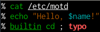

zsh-readable: A bugfixes branch for zsh-syntax-highlighting
===========================================================

__This repository was created as a fork of [zsh-syntax-highlighting][1] that
contained some bugfixes and compatibility patches, because upstream was
abandoned / unmanned / unmaintained.  Shortly after creating the fork, I was
granted commit access upstream, and merged the fork back into the original
upstream project.  This repository is now deprecated, but is left online for
historical interest.__

[1]: https://github.com/zsh-users/zsh-syntax-highlighting

`zsh-readable` provides syntax highlighting in interactive `zsh` sessions.
It is a fork of [zsh-syntax-highlighting](https://github.com/zsh-users/zsh-syntax-highlighting)
with some bugfixes and compatibility patches applied.

The following patches are included:

* Docs: Clarify installation instructions
  ([PR 158](zsh-users/zsh-syntax-highlighting#158]))

* Fix highlighting of: commands that span line boundaries (e.g.,
  with multiline string literals or backslash-newline line continuations)
  ([PR 159](zsh-users/zsh-syntax-highlighting#159]))

* Fix highlighting of: prefix redirections (e.g., `<file command arg1 arg2`)
  ([PR 161](zsh-users/zsh-syntax-highlighting#161]))

* Feature: support the '`paste`' '`$zle_highlight`' context (new in zsh 5.0.9)
  ([PR 175](zsh-users/zsh-syntax-highlighting#175]))

* Fix highlighting of: The first element of array assignments (e.g.,
  the "hello" in `typeset -a words; words=(hello world)`)
  ([PR 179](zsh-users/zsh-syntax-highlighting#179]))

How do I use this?
------------------

If you have an existing clone of `zsh-syntax-highlighting`, add a remote and
switch to it:

    git remote add zsh-readable https://github.com/zsh-readable/zsh-readable/
    git fetch zsh-readable
    git checkout -b bugfixes zsh-readable/bugfixes

If you do not already have a clone, create one:

    git clone --origin=zsh-readable https://github.com/zsh-readable/zsh-readable/

Then source the file `./zsh-syntax-highlighting.zsh` at the end of your
`.zshrc` file:

    echo 'source ~/zsh-readable/zsh-syntax-highlighting.zsh' >> ~/.zshrc

In either case, your local repository will have a local branch called `bugfixes`
which tracks the eponymous branch of the `zsh-readable/zsh-readable`
repository.  Note the remote is called `zsh-readable`, not `origin` as usual.
(If you followed the `git remote add …` steps, the `origin` remote will still
point to the upstream `zsh-users/zsh-syntax-highlighting` repository.)

Why did you fork?
-----------------

In short, because upstream appears to be unmanned (i.e., abandoned).

We have made bugfixes and added compatibility with new shell features, and
submitted each of those upstream as a patch (pull request), but the maintainers
did not respond, and users started asking us to maintain an integrated branch
with all our fixes.  So we did.

We would like to collaborate with upstream.  The only reason we aren't doing so
is that we [knocked on the door and nobody answered](http://www.zsh.org/mla/users/2015/msg00697.html).

In general, our view of the fork is [well captured by Karl Fogel's advice on
the matter](http://www.producingoss.com/en/forks.html#forks-initiating).

Development model
-----------------

Patches should be based on the tip of the `bugfixes` branch — that's our main
development branch, since `master` tracks upstream.

Feedback? Questions?
--------------------

Feel free to email the authors or open a github issue with any questions,
comments, or bugs.

The upstream zsh-syntax-highlighting README follows.

zsh-syntax-highlighting
=======================

**[Fish shell](http://www.fishshell.com) like syntax highlighting for [Zsh](http://www.zsh.org).**

*Requirements: zsh 4.3.17+.*

How to install
--------------

### Using packages

* Arch Linux: [community/zsh-syntax-highlighting](https://www.archlinux.org/packages/zsh-syntax-highlighting) / [AUR/zsh-syntax-highlighting-git](https://aur.archlinux.org/packages/zsh-syntax-highlighting-git)
* Gentoo: [mv overlay](http://gpo.zugaina.org/app-shells/zsh-syntax-highlighting)

### In your ~/.zshrc

* Download the script or clone this repository:

        git clone git://github.com/zsh-users/zsh-syntax-highlighting.git

* Source the script **at the end** of `~/.zshrc`:

        source /path/to/zsh-syntax-highlighting/zsh-syntax-highlighting.zsh

* Source `~/.zshrc`  to take changes into account:

        source ~/.zshrc

### With oh-my-zsh

* Download the script or clone this repository in [oh-my-zsh](http://github.com/robbyrussell/oh-my-zsh) plugins directory:

        cd ~/.oh-my-zsh/custom/plugins
        git clone git://github.com/zsh-users/zsh-syntax-highlighting.git

* Activate the plugin in `~/.zshrc` (in **last** position):

        plugins=( [plugins...] zsh-syntax-highlighting)

* Source `~/.zshrc`  to take changes into account:

        source ~/.zshrc

FAQ
---

### Why must `zsh-syntax-highlighting.zsh` be sourced at the end of the `.zshrc` file?

`zsh-syntax-highlighting.zsh` wraps ZLE widgets.  It must be sourced after all
custom widgets have been created (`zle -N`).

How to tweak
------------

Syntax highlighting is done by pluggable highlighter scripts, see the [highlighters directory](highlighters)
for documentation and configuration settings.
